# tc3-auth-lambda

Repositório de **funções serverless** do Tech Challenge Fase 3 (FIAP SOAT) — sistema de gestão de oficina mecânica. É um dos **4 repositórios** da solução e a **porta de entrada** de toda a aplicação: além das funções, provisiona o **API Gateway** que roteia o tráfego para elas e para a API no cluster.

Contém **duas** AWS Lambda, atrás do **mesmo API Gateway**:

| Função | Rota | Papel |
|---|---|---|
| **Autenticação por CPF** | `POST /auth` | Valida o CPF, confirma que o cliente existe e está **ATIVO** no banco e devolve um **JWT** aceito pela API da oficina. |
| **Notificações por e-mail** | `POST /mail` | Recebe uma solicitação autenticada da API e envia o e-mail (orçamento, finalização, entrega) via **SMTP**. Isola o SMTP fora da aplicação — é a peça "serverless de notificações" da fase. |

As rotas protegidas da aplicação também passam por este API Gateway (`ANY /{proxy+}` → ALB via VPC Link).

## Arquitetura

```mermaid
graph TB
    Cliente["Cliente / Funcionário<br/>browser · curl · Postman"]

    subgraph AWS["AWS · us-east-1"]
        GW["<b>API Gateway</b> (HTTP API v2)<br/>POST /auth · POST /mail<br/>ANY /&#123;proxy+&#125; → ALB (VPC Link)"]
        SSM["<b>SSM Parameter Store</b><br/>JWT_SECRET · MAIL_API_TOKEN<br/>MAIL_HOST/PORT/USER/PASS (SecureString)"]

        subgraph VPC["VPC — subnets privadas"]
            Auth["<b>Lambda — auth</b><br/>valida CPF · consulta cliente<br/>assina JWT (HS256)"]
            Mail["<b>Lambda — e-mail</b><br/>valida token · envia via SMTP"]
            ALB["<b>ALB</b> → API no EKS<br/>(repo tech-challenge-fiap)"]
            RDS[("<b>RDS PostgreSQL</b><br/>gerenciado · TLS")]
        end
    end

    SMTP["<b>SMTP</b><br/>Ethereal (testes) / SES (real)"]

    Cliente -->|"POST /auth &#123;cpf&#125;"| GW
    GW -->|"/auth"| Auth
    Auth -->|"SELECT cliente (TLS)"| RDS
    Auth -->|"lê JWT_SECRET"| SSM
    Auth -->|"JWT { token, cliente }"| Cliente

    Cliente -->|"Bearer JWT (rotas protegidas)"| GW
    GW -->|"ANY /&#123;proxy+&#125; (VPC Link)"| ALB
    ALB -->|"valida o JWT com o MESMO segredo<br/>(sem chamar a Lambda)"| ALB

    ALB -->|"POST /mail + x-mail-api-token"| GW
    GW -->|"/mail"| Mail
    Mail -->|"lê MAIL_API_TOKEN + SMTP"| SSM
    Mail -->|"envia e-mail"| SMTP
```



O ponto-chave do desenho: a **autenticação é desacoplada por segredo compartilhado**. A Lambda de auth *emite* o JWT; a API no EKS apenas o *valida* com o **mesmo segredo** (lido do SSM) — as duas nunca se chamam. A notificação, ao contrário, é uma chamada síncrona: a API faz `POST /mail` com um token interno, e a Lambda de e-mail encapsula o SMTP.

## O que este repositório cria (Terraform)

| Recurso | Detalhe |
|---|---|
| `aws_lambda_function.auth` | Node.js 22, dentro da VPC para alcançar o RDS |
| `aws_lambda_function.mail` | Node.js 22, envia e-mail via SMTP (nodemailer) |
| API Gateway HTTP API v2 | Rotas `POST /auth`, `POST /mail` e `ANY /{proxy+}` (VPC Link → ALB) |
| `aws_ssm_parameter.jwt_secret` | Segredo do JWT (HS256), gerado pelo Terraform — o **mesmo** que a API valida |
| `aws_ssm_parameter.mail_api_token` | Token interno (`random_password`) entre a API e a rota `/mail` |
| Parâmetros SSM de SMTP | `MAIL_HOST`, `MAIL_PORT`, `MAIL_USER`, `MAIL_PASS` (config do provedor de e-mail) |
| Security groups | Liberam a Lambda de auth no Postgres |
| Log groups + New Relic | Observabilidade das duas funções (ver seção abaixo) |

## Tecnologias

TypeScript · Node.js 22 · `pg` · `jsonwebtoken` · `nodemailer` · `@aws-sdk/client-ssm` · esbuild · Terraform ≥ 1.10 · AWS Lambda · API Gateway HTTP v2 · GitHub Actions (OIDC)

## Dependências entre repositórios

Depende de [`tc3-infra-k8s`](https://github.com/tiagostorch/tc3-infra-k8s) (rede/VPC, ALB, bootstrap OIDC) e de [`tc3-infra-db`](https://github.com/tiagostorch/tc3-infra-db) (banco, `DATABASE_URL` e o **prefixo do SSM**), lidos via `terraform_remote_state`. **Aplique os dois antes.**

> **Pré-requisito de schema:** a coluna `status` em `Cliente` precisa existir (ajuste de modelagem desta fase, feito no repo [`tech-challenge-fiap`](https://github.com/LucasValada/tech-challenge-fiap)). Sem ela a consulta da Lambda de auth falha.

---

## Função 1 — Autenticação por CPF (`POST /auth`)

O cliente da oficina autentica pelo CPF; a API do cluster protege as rotas sensíveis com o JWT emitido aqui.

**Fluxo:** `POST /auth {cpf}` → valida os dígitos verificadores → consulta o cliente no RDS (existe? **ATIVO**?) → assina um **JWT HS256** com o segredo do SSM → devolve `{ token, cliente }`. A API no EKS valida esse token com o mesmo segredo, sem chamar a função.

```bash
curl -X POST "$AUTH_URL" -H 'content-type: application/json' \
  -d '{"cpf":"529.982.247-25"}'
```

```json
{ "token": "eyJhbGciOiJIUzI1NiIs...", "expiresIn": "1h",
  "cliente": { "id": "uuid", "nome": "Fulano de Tal" } }
```

O token carrega `{ sub: <clienteId>, nome, tipo: "cliente" }`.

| Status | Situação |
|---|---|
| `200` | Cliente válido e ativo — token emitido |
| `400` | CPF ausente, malformado ou com dígito verificador inválido |
| `404` | CPF válido, mas sem cliente correspondente |
| `403` | Cliente encontrado, porém **inativo** |
| `500` | Falha ao consultar o banco |

## Função 2 — Notificações por e-mail (`POST /mail`)

Recebe uma solicitação da API (máquina-a-máquina) e envia o e-mail. **Não é pública:** exige o header `x-mail-api-token`, comparado em tempo constante (`timingSafeEqual`) com o `MAIL_API_TOKEN` do SSM. A configuração de SMTP (host/porta/usuário/senha) também vem do SSM — trocar o provedor de e-mail (Ethereal → SES) não mexe no código.

```bash
curl -X POST "$MAIL_URL" \
  -H 'content-type: application/json' \
  -H "x-mail-api-token: <MAIL_API_TOKEN do SSM>" \
  -d '{"to":"cliente@exemplo.com","subject":"Orçamento OS-2026-000001","text":"..."}'
```

```json
{ "message": "Email enviado com sucesso." }
```

| Status | Situação |
|---|---|
| `200` | E-mail enviado |
| `400` | Corpo inválido — `to`, `subject` e `text` são obrigatórios |
| `401` | `x-mail-api-token` ausente ou incorreto |
| `405` | Método diferente de `POST` |
| `500` | Falha ao ler a config no SSM ou ao enviar via SMTP |

> Quem chama esta rota é a **API da oficina**, de forma **best-effort**: uma falha aqui é logada, mas não bloqueia a transição de status da OS. Detalhe da integração no README do repo [`tech-challenge-fiap`](https://github.com/LucasValada/tech-challenge-fiap#notificações-por-e-mail-lambda).

---

## Execução local

```bash
npm ci
npm test          # testes: validação de CPF, handler de e-mail e observabilidade
npm run lint      # tsc --noEmit
npm run package   # gera auth-lambda.zip e mail-lambda.zip (esbuild)
```

## Deploy

```bash
npm run package

cd infra
cp terraform.tfvars.example terraform.tfvars   # editar (região, provedor de e-mail, New Relic...)
terraform init -backend-config="bucket=SEU_BUCKET"
terraform apply
```

Endereços saem nos outputs (`terraform output`):

| Output | O que é |
|---|---|
| `api_endpoint` | Base do API Gateway |
| `auth_url` | `…/auth` (autenticação por CPF) |
| `mail_url` | `…/mail` (consumido pela API como `MAIL_LAMBDA_URL`) |
| `ssm_jwt_secret_name` | Nome do parâmetro SSM do `JWT_SECRET` (compartilhado com a API) |
| `ssm_mail_api_token_name` | Nome do parâmetro SSM do `MAIL_API_TOKEN` (consumido pela API como `MAIL_LAMBDA_TOKEN`) |
| `ssm_mail_smtp_parameter_names` | Nomes dos parâmetros de SMTP a preencher com as credenciais reais |

> Após o `apply`, preencha os parâmetros de **SMTP** no SSM (`MAIL_HOST`, `MAIL_PORT`, `MAIL_USER`, `MAIL_PASS`) com as credenciais do provedor de e-mail (para testes, uma conta [Ethereal](https://ethereal.email)). O `JWT_SECRET` e o `MAIL_API_TOKEN` são gerados pelo Terraform.

## CI/CD

`.github/workflows/deploy.yml`

- **Pull request** → lint, testes, empacotamento e `terraform plan`
- **Push em `develop`** → deploy automático (rótulo `homolog` no GitHub)
- **Push em `main`** → deploy automático (rótulo `production` no GitHub)

> **Ambiente único:** `develop` e `main` aplicam no **mesmo** ambiente na AWS (mesmo state e recursos) — a distinção homologação/produção é apenas o rótulo do deploy no GitHub e foi desconsiderada.

Secrets necessários: `AWS_ROLE_ARN` e `TF_STATE_BUCKET` (do bootstrap em `tc3-infra-k8s`) e `NEW_RELIC_ACCOUNT_ID`. A ARN da layer do New Relic entra como *variable* do repositório (`NEWRELIC_LAYER_ARN`) — é valor público. A **license key** não passa pelo CI nem pelo Terraform: a função recebe só o **nome** do parâmetro no SSM (`NEW_RELIC_LICENSE_KEY_SSM_PARAMETER_NAME`) e a extension lê a chave em runtime.

Localmente, os valores ficam no `.env` da raiz (ignorado pelo git): `set -a; source .env; set +a` antes do `terraform plan`.

## Observabilidade

As duas funções são instrumentadas pela **layer do New Relic**, que traz o agente Node e a **extension** — um processo do runtime que recolhe métrica, trace e log dentro da própria invocação e faz POST direto na API do New Relic:

```
handler ──▶ agente ──▶ extension ──HTTPS──▶ New Relic
```

Sem ela, o caminho seria CloudWatch + subscription filter + Lambda de ingestão — cobrado por GB duas vezes. Para o log group não ser criado às escondidas, a política `AWSLambdaVPCAccessExecutionRole` foi trocada por uma própria com as permissões de ENI e **sem** `logs:*`; `cloudwatch_logs_enabled = true` devolve o comportamento padrão para depurar.

**Correlação W3C Trace Context.** O agente adota o `traceparent` recebido pelo API Gateway e devolve `traceresponse` com o mesmo trace-id, fechando o trace distribuído com a API do cluster. O CORS libera `traceparent`, `tracestate`, `newrelic` e `x-correlation-id` e expõe `traceresponse`.

```bash
curl -si -X POST "$(terraform -chdir=infra output -raw auth_url)" \
  -H "traceparent: 00-$(openssl rand -hex 16)-$(openssl rand -hex 8)-01" \
  -H 'content-type: application/json' -d '{"cpf":"<cpf>"}' | grep -i traceresponse
```

A ARN da layer muda por região e versão do agente e vai em `newrelic_layer_arn` (lista em <https://layers.newrelic-external.com>). O detalhamento — tabela completa de variáveis e NRQL — está em [`tc3-infra-k8s/OBSERVABILIDADE.md`](https://github.com/tiagostorch/tc3-infra-k8s/blob/main/OBSERVABILIDADE.md).

## Decisões registradas

- **`pg` em vez do Prisma na Lambda** — o engine do Prisma pesa dezenas de MB e encarece o cold start; a função de auth faz uma única consulta, o driver puro basta.
- **Função de auth dentro da VPC** — obrigatório para alcançar um RDS não público; o custo é um cold start maior, aceitável para o volume.
- **Segredo compartilhado (HS256)** — mais simples que JWKS para o escopo da fase; a API valida localmente, sem round-trip.
- **SMTP na Lambda de e-mail, config no SSM** — isola o provedor de e-mail da aplicação; trocar Ethereal por SES não toca no código do app.
- **Token interno na rota `/mail`** (`x-mail-api-token`, `timingSafeEqual`) — a rota não é pública; só a API com o token do SSM a chama.

Estas decisões viram ADRs na documentação oficial da entrega (repo [`tech-challenge-fiap`](https://github.com/LucasValada/tech-challenge-fiap)).
